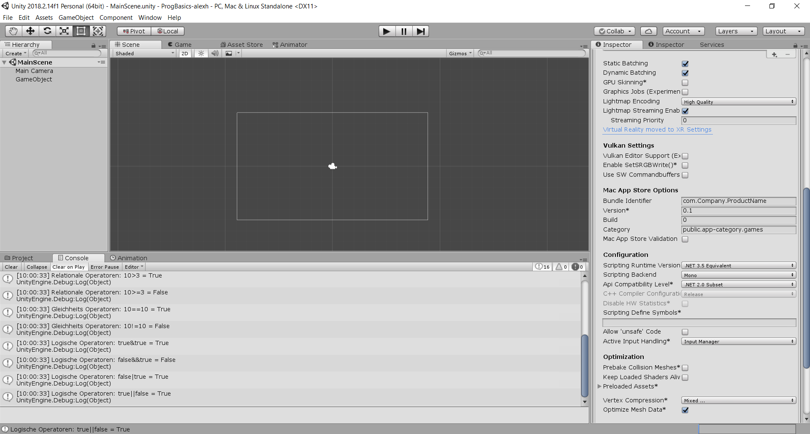
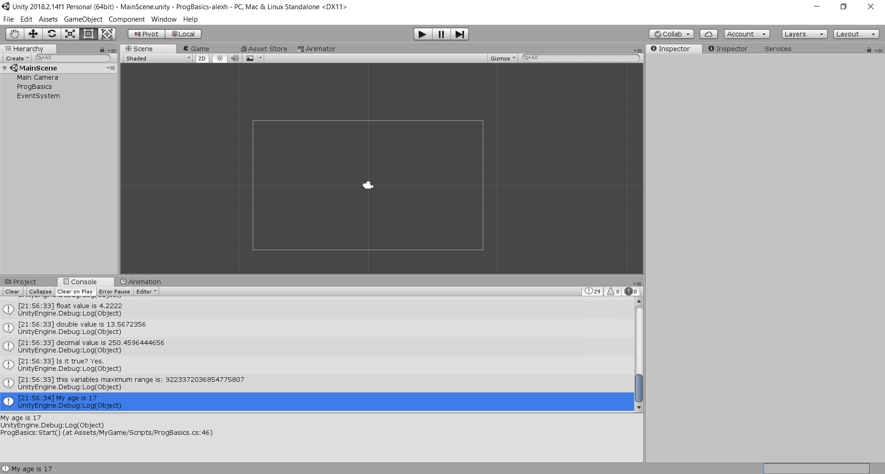

# ProgBasics-alexh

**Progress:** 100%

### Development Platform
  * OS: Windows 10 Version 1803
  * Unity: Version 2018.2.14f1
  * Visual Studio: Version 15.9.10
  * Scripting Runtime Version: .NET 3.5 Equivalent
  * API Compatibility Level: .NET 2.0 Subset

### Erste Tests mit Operatoren
  Mit Debug.Log in einem C# Script wurden diverse Multiplikative, Additive, Relationale, Gleichheits und Logische Operatoren in die Unity Console geprintet.

- Screenshots

### Variablen-Typen und Methoden Tests
Diverse Variablen-Typen und Methoden wurden mit Debug.Log in einem C# Script getestet.

- Screenshots

### Lessons learned
- Umgang mit Methoden und Variablen in C#

##### © Copyright by Alexander Hödlmoser

 

